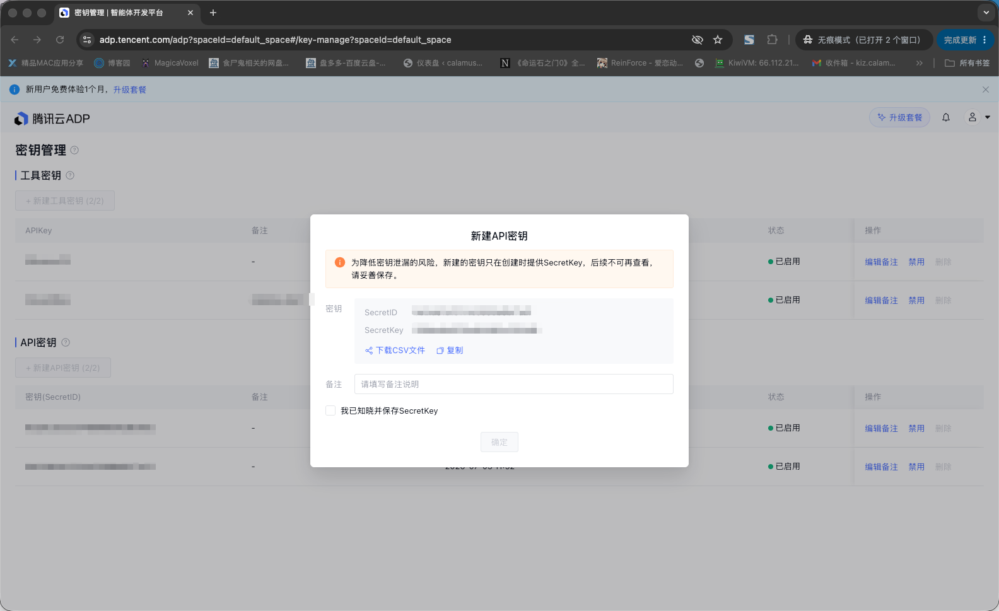
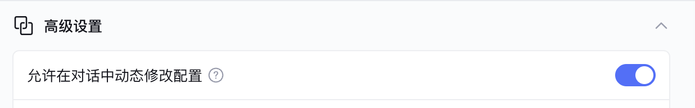
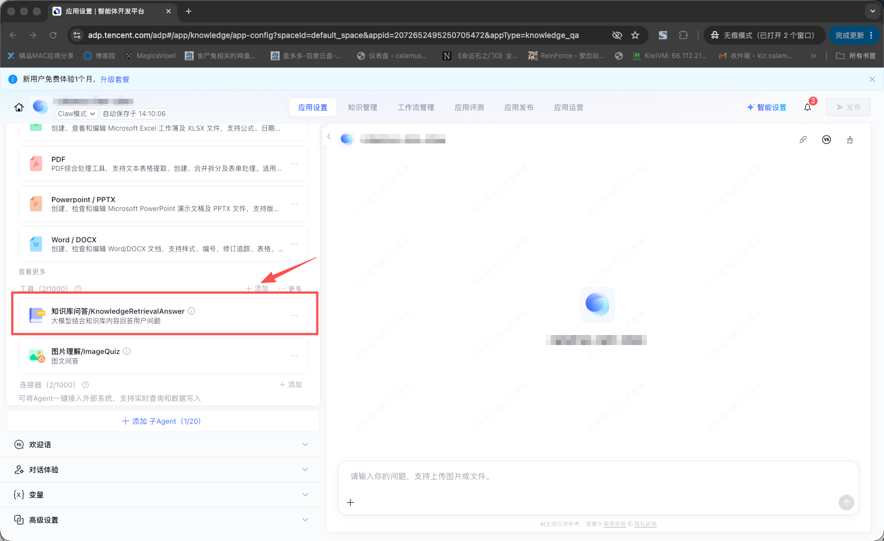

<div align="center">

[](./LICENSE)
[](https://github.com/TencentCloudADP/adp-chat-client)
[](assets/wechat_qr.png)
[](https://discord.gg/dwHuBUKkxw)

[🔖 中文版](README.cn.md) • [🚀 Quickly Start Guide](#Docker)

</div>

# About

**ADP-Chat-Client** is an open sourced AI Agent application conversation interface. It allows developers to quickly deploy AI agent applications developed on the [Tencent Cloud Agent Development Platform (Tencent Cloud ADP)](https://adp.tencentcloud.com/) as web applications (or embed them into mini-programs, Android, and iOS apps). The client supports real-time conversations, conversation history management, voice input, image understanding, interactive Widgets (charts, forms, etc.), third-party account system integration, and more. It supports fast deployment via Docker.

#### Table of Contents

- [Deployment](#deployment)
  - [Account System Integration](#account-system-integration)
- [Development Guide](#development-guide)
  - [Backend](#backend)
  - [Frontend](#frontend)
- [Advanced Topics](#advanced-topics)
  - [Agent: VisitorId Configuration](#agent-visitorid-configuration)
  - [Agent: Variables - API Parameters](#agent-variables---api-parameters)
  - [Smart Agent: Quick Buttons Configuration](#smart-agent-quick-buttons-configuration)
  - [Deployment: nginx](#deployment-nginx)
  - [Deployment: Long Responses Are Cut Off](#deployment-long-responses-are-cut-off)
  - [Deployment: Subpath](#deployment-subpath)
  - [Deployment: Rate Limiting](#deployment-rate-limiting)
  - [Deployment: CORS](#deployment-cors)
  - [Deployment: Iframe Embed Origins](#deployment-iframe-embed-origins)
  - [Deployment: File Preview Service](#deployment-file-preview-service)
  - [WeChat Mini Program Integration](#wechat-mini-program-integration)

# Deployment

## System Requirements

Please ensure the machine meets the minimum requirements:

- CPU >= 2 Core
- RAM >= 4 GiB
- Operating System: Linux/macOS. If you want to run on Windows, you need to use WSL or a cloud server with a Linux system.

## Browser Compatibility (H5)

This project is built with Vue 3 and Vite, which requires modern browser support:

|  Chrome |  Firefox |  Safari |  Edge |  iOS Safari |  Android |
| :---: | :---: | :---: | :---: | :---: | :---: |
| >= 87 | >= 78 | >= 14 | >= 88 | >= 14 | >= 87 |

> ⚠️ **Note**: Internet Explorer is **NOT** supported. Vue 3 has dropped IE11 support.

## Docker

1. Clone the source code and enter the project directory.

```bash
git clone https://github.com/TencentCloudADP/adp-chat-client.git
cd adp-chat-client
```

2. Install docker (skip if docker is already installed on your system):

> For TencentOS Server 4.4:

```bash
bash script/init_env_tencentos.sh
```
> For Ubuntu Server 24.04:

```bash
bash script/init_env_ubuntu.sh
```

3. Copy the ```.env.example``` file to the deploy folder:

```bash
cp server/.env.example deploy/default/.env
```

4. Edit the ```deploy/default/.env``` file:

You need to fill in the following credentials and application keys based on your Tencent Cloud account and ADP platform information:

```
# Tencent Cloud account secret: https://console.tencentcloud.com/cam/capi
TC_SECRET_APPID=
TC_SECRET_ID=
TC_SECRET_KEY=

# ADP platform-specific secrets (required only when ServiceVendor is "ChinaTencentADP")
# See the standalone site guide below for how to obtain them
ADP_SECRET_ID=
ADP_SECRET_KEY=

# Tencent Cloud ADP platform agent app key:
# - China public cloud: https://adp.cloud.tencent.com/
# - Standalone site (独立站): https://adp.tencent.com/
APP_CONFIGS='[
    {
        "Vendor":"Tencent",
        "ApplicationId":"The unique ID of the chat application, used to uniquely identify a chat application in this system. Recommended to use appid or generate a random uuid using the uuidgen command",
        "Comment": "Comment",
        "AppKey": "",
        "International": false
    },
    {
        "Vendor":"Tencent",
        "ApplicationId":"Standalone-site application unique ID",
        "Comment": "Standalone site comment",
        "AppKey": "",
        "ServiceVendor": "ChinaTencentADP"
    }
]'

# JWT secret key, a random string, can be generated using the uuidgen command
SECRET_KEY=

```

> ⚠️ **Note**:
> 1. The content of APP_CONFIGS is in JSON format. Please adhere to JSON specifications, e.g., the last item should not end with a comma, and // comments are not supported.
> 2. Comment: Can be filled in freely for easy identification of the corresponding agent application.
> 3. International: If the agent application is developed on the [ADP China cloud](https://adp.cloud.tencent.com/), set to `false` (default). Set to `true` for international site applications.
> 4. ApplicationId: Access any ADP application and check the appid in the application URL. For example, if an application's link is `https://adp.cloud.tencent.com/adp/#/app/knowledge/app-config?appid=197******768&appType=knowledge_qa&spaceId=default_space`, then its ApplicationId is 197******768.
> 5. Vendor: Fixed to "Tencent", other options may be available for other platforms in the future.
> 6. To configure multiple applications, simply append more objects to the APP_CONFIGS array in the same format.
> 7. **ServiceVendor**: Optional values — `"ChinaTencentCloud"` (**default**, China public cloud) / `"ChinaTencentADP"` (**standalone site / 独立站**) / `"International"` (international site) / `"Private"` (private deployment). Must set to `"ChinaTencentADP"` when using the standalone ADP instance.
> 8. **ADP_SECRET_ID / ADP_SECRET_KEY**: Required only when at least one application uses `"ServiceVendor": "ChinaTencentADP"`. Used for API authentication against the standalone ADP instance. If left empty, falls back to TC_SECRET_ID / TC_SECRET_KEY.

#### Quick Buttons Suggestion Configuration (Optional)

You can configure `SUGGESTION_CONFIGS` to display quick-button prompt templates above the input box on the chat page. Users can click a suggestion to auto-fill it into the input field. If not configured, no quick buttons will be shown.

Configuration format:

```bash
SUGGESTION_CONFIGS='[
    {
        "GroupId": "Unique group ID",
        "IconUrl": "Group icon URL (supports https remote images)",
        "Name": "Group name (e.g. Document Processing, Data Analysis)",
        "SuggestionList": [
            {
                "SuggestionId": "Unique suggestion ID",
                "Title": "Suggestion title",
                "PromptContent": "Prompt text that fills into the input box on click"
            }
        ]
    }
]'
```

Interaction:
- **Level 1**: Horizontally scrollable group list with icon + name
- **Level 2**: Click a group to expand horizontal suggestion cards (title + description)
- **Click suggestion**: Fills `PromptContent` into the input box; user can edit before sending
- **Back**: Click the back arrow in the top-left corner to return to groups

`PromptContent` supports mention syntax (optional):
- `@skill:<skill-name>` — reference a Skill installed on the current agent
- `@knowledgeBase:<kb-name>` — reference an attached knowledge base
- `@tool:<tool-name>` — reference a registered tool (**connectors use the same `@tool:` prefix as tools**)

Mentions are rendered as colored chips inside the input box after the suggestion is filled. The referenced entity must already be installed / attached on the current agent.

> ⚠️ **Format note**: The whole value is wrapped in single quotes `'...'`, so the JSON body **must not contain any ASCII single quote `'` (U+0027)**. If you need to quote a phrase inside `PromptContent`, use full-width Chinese quotes `“…”` / `‘…’`, or drop the quotes. Otherwise, in Docker deploy mode dotenv will treat the inner `'` as the closing delimiter and `SUGGESTION_CONFIGS` will silently fall back to an empty list — no quick buttons will be shown.

5. Build docker image
```bash
# Build image (The initial deployment requires packing, and it needs to be rerun after code changes, no need to repack if you only modify the .env file).
sudo make pack
```

6. Start the container
```bash
sudo make deploy
```
Open the browser and navigate to http://localhost:8000 to view the login page.

> ⚠️ **Warning:** For production environment, you need to apply for an SSL certificate through your own domain and deploy it over HTTPS using nginx for reverse proxy or other methods. If deployed over HTTP, certain features (such as voice recognition, message copying, etc.) may not function properly.

7. Login

This system supports integration with existing account systems. Here, we demonstrate the [URL Redirection](#URL-Redirection) login method:

``` bash
sudo make url
```

The above command retrieves the login URL. Open this URL in the browser for login.

If OAuth login is configured, you can log in by opening http://localhost:8000 in the browser.

8. Troubleshooting
``` bash
# Check if the containers are running. Normally, there should be 2 containers: adp-chat-client-default, adp-chat-client-db-default
sudo docker ps

# If no containers are visible, it indicates a startup issue. You can check the logs:
sudo make logs
```

## Video Tutorial

[📺 Video Tutorial](https://pub-eada7a74aa3243c1a5c7b627deafeac9.r2.dev/adp-chat-client.mp4)

## Service Configuration

To use the system, enable/configure the following services:
1. Dialogue title generation: [Tencent Cloud DeepSeek OpenAI API](https://www.tencentcloud.com/document/product/1255/70381).
2. Voice input: [Speech Recognition: Settings](https://www.tencentcloud.com/products/asr), enable: Real-time speech recognition for the required region.
3. App Permission: Make sure the account associated with your TC_SECRET_ID/TC_SECRET_KEY has permission to access the applications you’ve added. For details, see the [platform-side user permissions documentation](https://www.tencentcloud.com/document/product/1254/73347).

## Account System Integration

### OAuth

### GitHub OAuth

GitHub OAuth is supported by default. You can can configure it as needed:
```
# you can obtain it from https://github.com/settings/developers
OAUTH_GITHUB_CLIENT_ID=
OAUTH_GITHUB_SECRET=
```
> 📝 **Note**：When creating a GitHub OAuth application, fill in the callback URL as：SERVICE_API_URL+/oauth/callback/github, for example: http://localhost:8000/oauth/callback/github

### Microsoft Entra ID OAuth

Microsoft Entra ID OAuth is supported by default. You can can configure it as needed:
```
# you can obtain it from https://entra.microsoft.com
OAUTH_MICROSOFT_ENTRA_CLIENT_ID=
OAUTH_MICROSOFT_ENTRA_SECRET=
# Endpoint (optional, if you have a tenant id, default: common), see: https://learn.microsoft.com/en-us/entra/identity-platform/authentication-national-cloud
OAUTH_MICROSOFT_ENTRA_ENDPOINT=common
```
> 📝 **Note**：When creating a Microsoft Entra ID OAuth application, fill in the callback URL as：SERVICE_API_URL+/oauth/callback/ms_entra_id, for example: http://localhost:8000/oauth/callback/ms_entra_id

### ADP Standalone Site (ChinaTencentADP) Credentials

When your agent application is deployed on the **ADP Standalone Site** ([https://adp.tencent.com](https://adp.tencent.com/)), you need to configure the standalone-site-specific secrets `ADP_SECRET_ID` / `ADP_SECRET_KEY` and declare `ServiceVendor: "ChinaTencentADP"` on the corresponding application.

#### Step 1: Obtain Standalone API Credentials

1. Log in to the **ADP Standalone Site**: [https://adp.tencent.com](https://adp.tencent.com/)
2. Navigate to the **Key Management** page: [https://adp.tencent.com/adp#/key-manage](https://adp.tencent.com/adp#/key-manage)
3. Click the **「+ New API Key (+ 新建 API 密钥)」** button


4. After confirming creation in the popup dialog, the system displays `SecretID` and `SecretKey`



> ⚠️ **Important**: The SecretKey is shown **only once** at creation time and cannot be retrieved later. Make sure to save it securely.

#### Step 2: Fill in .env (do NOT commit real secrets to the repository)

In `deploy/default/.env`, fill in the following fields:

```bash
# ADP standalone-site secrets (required only when ServiceVendor is "ChinaTencentADP")
# Get them from: https://adp.tencent.com/adp#/key-manage
ADP_SECRET_ID=
ADP_SECRET_KEY=
```

- Copy the **SecretID** from the dialog into `ADP_SECRET_ID`
- Copy the **SecretKey** from the dialog into `ADP_SECRET_KEY`
- Add `"ServiceVendor": "ChinaTencentADP"` to the corresponding application object inside `APP_CONFIGS`

```bash
APP_CONFIGS='[
    {
        "Vendor": "Tencent",
        "ApplicationId": "Standalone-site application unique ID",
        "Comment": "Standalone site comment",
        "AppKey": "",
        "ServiceVendor": "ChinaTencentADP"
    }
]'
```

> 💡 **Tip**: If `ADP_SECRET_ID` / `ADP_SECRET_KEY` are left empty, the system falls back to `TC_SECRET_ID` / `TC_SECRET_KEY`. You can mix multiple source types within the same `APP_CONFIGS` array (public cloud + standalone + international) — just ensure each application object has the correct `ServiceVendor` value.


### Other OAuth providers

> OAuth protocol enables seamless authentication and authorization. Developers can customize authentication methods according to their requirements. If you need to use a different OAuth system, you can modify the `server/core/oauth.py` file to adapt to the specific protocol.

### URL Redirection

If you have an existing account system but do not implement a standard OAuth flow, you can integrate with the system using a URL redirect method for simpler integration.

1. **Your account service:** Generate a URL pointing to this system, carrying CustomerId, Name, Timestamp, ExtraInfo, Code, etc.
2. **User:** Clicks the URL to login to their account.
3. **This system:** Verifies the signature, auto-creates/binds the account, generates a login session, and redirects to the chat page.

###### Parameter details:

| Parameter | Description |
| :----------- | :-----------|
| url | https://your-domain.com/account/customer?CustomerId=&Name=&Timestamp=&ExtraInfo=&Code= |
| CustomerId | Your account system's uid |
| Name | Your account system's username (optional) |
| Timestamp | Current timestamp |
| ExtraInfo | User information |
| Code | Signature, SHA256(HMAC(CUSTOMER_ACCOUNT_SECRET_KEY, CustomerId + Name + ExtraInfo + str(Timestamp))) |

> 📝 **Note**:
> 1. The parameters above must be URL-encoded, for more details you can refer to the CoreAccount.customer_auth in `server/core/account.py` file, and generate_customer_account_url in `server/main.py` file for URL generation method.
> 2. Configure CUSTOMER_ACCOUNT_SECRET_KEY in the .env file, a random string that can be generated using the uuidgen command.

### I want users to be able to use the service directly without logging in.

If you don't have your own account system and want new users to be able to access the chat interface immediately upon opening the link, you can achieve this by setting `AUTO_CREATE_ACCOUNT` in your .env file:

```
AUTO_CREATE_ACCOUNT=true
```

> 📝 **Note:** This will automatically create an account for each new user. Although this system has flow control settings, creating new accounts without restrictions makes it easy to bypass flow control. Using this mode in a publicly production system is not recommended.

# Development Guide

## Backend

### Dependencies

- python >= 3.12
- uv ~= 0.8

### Debugging

#### Command Line

```bash
# 1. Execute all the steps in [Deployment] section
# 2. Copy the edited .env file to the server folder
cp deploy/default/.env server/.env

# 3. Initialize (only needed on the first run)
make init_server

# 4. continue to [Frontend] section below.
```

## Frontend

### Dependencies

- node >= 20

``` bash
curl -o- https://raw.githubusercontent.com/nvm-sh/nvm/v0.40.3/install.sh | bash
source ~/.bashrc
nvm install v22
```

### Debugging

#### Command Line

```bash
# Initialize (only needed on the first run)
make init_client

# Run the backend/frontend together with a PostgreSQL container.
# The terminal will print the debugging URL, such as: [ui]   ➜  Local:   http://localhost:5173/
# The database data is persisted in deploy/dev/volume/db.
# Ensure PGSQL_HOST in server/.env is localhost or 127.0.0.1.
make dev_withdb

# If you already have your own PostgreSQL instance and do not need to start a local one, run:
make dev
```

### Architecture

| Component | Description |
| :----------- | :-----------|
| config | Configuration system |
| core | Core logic, not bound to specific protocols (e.g., HTTP or stdio) |
| middleware | Middleware for the Sanic server |
| model | ORM definitions for entities, e.g., Account |
| router | Externally exposed HTTP endpoints, typically wrapping core logic |
| static | Static files |
| test | Testing |
| util | Other utility classes |

# Advanced Topics

## Agent: VisitorId Configuration

When calling Tencent Cloud ADP chat, this service sends a `VisitorId` to ADP. You can configure which account field is used by setting `ADP_VISITOR_ID_TYPE` in `.env`:

```bash
ADP_VISITOR_ID_TYPE=NAME
```

Supported values:

| Value | Behavior |
| --- | --- |
| `NAME` | Default. Use the user's display name as `VisitorId`. |
| `CUSTOMER_ID` | Use the `CustomerId` bound during account-system integration as `VisitorId`. |

This setting only changes the `VisitorId` sent to ADP. Local session, conversation ownership, and permission checks still use this system's internal account ID.

## Agent: Variables - API Parameters

When calling the agent for conversation, you can pass parameters to the agent. Depending on the specific situation, you can choose to pass them on the frontend or backend. Here is an example of adding API parameters on the backend:

```python
# Edit file: server/router/chat.py
class ChatMessageApi(HTTPMethodView):
    @login_required
    async def post(self, request: Request):
        parser = reqparse.RequestParser()
        parser.add_argument("Query", type=str, required=True, location="json")
        parser.add_argument("ConversationId", type=str, location="json")
        parser.add_argument("ApplicationId", type=str, location="json")
        parser.add_argument("SearchNetwork", type=bool, default=True, location="json")
        parser.add_argument("CustomVariables", type=dict, default={}, location="json")
        args = parser.parse_args(request)
        logging.info(f"ChatMessageApi: {args}")

        application_id = args['ApplicationId']
        vendor_app = app.get_vendor_app(application_id)

        # Add the following code to attach additional API parameters during conversation:
        import json
        from core.account import CoreAccount
        account = await CoreAccount.get(request.ctx.db, request.ctx.account_id)
        account_third_party = await CoreAccount.get_third_party(request.ctx.db, request.ctx.account_id)
        # Note the json.dumps here: Tencent Cloud ADP convention requires that if the value is a dictionary, it needs to be JSON-encoded once and converted to a JSON string
        args['CustomVariables']['account'] = json.dumps({
            "id": account_third_party.OpenId if account_third_party else str(account.Id),
            "name": account.Name if account else "",
        })
        logging.info(f"[ChatMessageApi] ApplicationId: {application_id},\n\
            CustomVariables: {args['CustomVariables']},\n\
            vendor_app: {vendor_app}")

```

## Smart Agent: Quick Buttons Configuration

You can configure `SUGGESTION_CONFIGS` to display quick-button prompt templates above the input box on the Web chat page. This feature mirrors the "Prompt Suggestion" (DescribePromptSuggestionList) capability of the Agent Development Platform, reading data entirely from the configuration file without backend API calls.

### Data Structure

`SUGGESTION_CONFIGS` is a JSON array where each item is a group containing a suggestion list:

```json
[
    {
        "GroupId": "Unique group identifier (string)",
        "IconUrl": "Group icon URL (supports https remote images, recommended 32x32px)",
        "Name": "Group name",
        "SuggestionList": [
            {
                "SuggestionId": "Unique suggestion identifier (string)",
                "Title": "Suggestion title (shown at the top of the card)",
                "PromptContent": "Text that fills into the input box on click"
            }
        ]
    }
]
```

### Interaction

| Level | Display | Action |
|-------|---------|--------|
| Level 1 (Groups) | Horizontal scrollable row, icon + name | Click to enter Level 2 |
| Level 2 (Suggestions) | Horizontal scrollable cards, each showing title + description (max 2 lines) | Click to fill `PromptContent` into input box and return to Level 1 |
| Back | Top of Level 2: group name with left arrow | Click to return to Level 1 |

> 📝 **Note**:
> 1. Quick buttons only appear when the message list is empty; they auto-hide after sending a message
> 2. Clicking a suggestion fills it into the input box **without auto-sending** — users can edit before sending
> 3. If not configured or set to an empty array `[]`, no quick button area will be shown
> 4. Icon loading failures will display a default placeholder icon

### Full Configuration Example

```bash
SUGGESTION_CONFIGS='[
    {
        "GroupId": "group-doc",
        "IconUrl": "https://cdn.example.com/icons/doc-process.png",
        "Name": "Document Processing",
        "SuggestionList": [
            {
                "SuggestionId": "sug-001",
                "Title": "Meeting Notes to Report",
                "PromptContent": "Please organize my uploaded meeting notes into a formal weekly report..."
            },
            {
                "SuggestionId": "sug-002",
                "Title": "Invoice Extraction",
                "PromptContent": "Please build an “Invoice Extraction” Skill: upload an invoice image or PDF, auto-detect key fields and output structured JSON."
            }
        ]
    },
    {
        "GroupId": "group-app",
        "IconUrl": "https://cdn.example.com/icons/app-build.png",
        "Name": "App Building",
        "SuggestionList": [
            {
                "SuggestionId": "sug-003",
                "Title": "Sales Analytics Assistant",
                "PromptContent": "Create a sales analytics assistant that supports natural-language queries over sales data and auto-generates charts. @skill:example-app-manager"
            }
        ]
    }
]'
```

### Advanced usage of PromptContent

Beyond plain text, `PromptContent` supports **mention references** in the form `@<type>:<name>`. When the suggestion is clicked, the mention is rendered as a colored chip inside the input box:

| Syntax | Meaning |
|--------|---------|
| `@skill:<skill-name>` | Reference a Skill installed on the current agent |
| `@knowledgeBase:<kb-name>` | Reference an attached knowledge base |
| `@tool:<tool-name>` | Reference a registered tool or connector (connectors reuse the `@tool:` prefix) |

The referenced entity must already be installed / attached on the current agent, otherwise the mention will not resolve to a chip and will be shown as plain text. Connectors and tools share the `@tool:` prefix; the frontend detects the connector by name among the agent's registered connectors and renders it as a "connector" chip.

### Format rules

`SUGGESTION_CONFIGS` is a multi-line JSON value wrapped by single quotes `'...'` in `.env`. Please follow the rules below to avoid parsing failures:

1. **Do NOT put an ASCII single quote `'` (U+0027) anywhere inside the JSON body**. If you need to quote a phrase inside `PromptContent`, use full-width Chinese quotes `“…”` / `‘…’`, or drop the quotes. Reason: in Docker deploy mode the backend parses `.env` strictly with `python-dotenv`, which treats the first inner `'` as the closing delimiter, discards the whole `SUGGESTION_CONFIGS` value, and the frontend ends up with an empty `GroupList` — no quick buttons will show up.
2. **JSON string values use double quotes `"..."`**; if you need a literal `"` inside the text, escape it as `\"`.
3. **Every `GroupId` / `SuggestionId` should be globally unique** — the frontend uses them as `key`.
4. **`IconUrl` must be publicly reachable via https**, recommended size 32×32 px.
5. **Restart the container/service after editing `.env`** to pick up the new value (no need to re-`pack` the image).

## Deployment: nginx

In production, the system is usually deployed behind nginx. The following settings must not be omitted, otherwise you may see stalled streaming responses, missing real client IPs on the backend, or incorrect rate limiting behavior.

Required settings:

1. `proxy_buffering off;`

The chat API uses SSE to stream responses. If this is omitted, nginx may buffer upstream responses, causing the frontend to receive delayed chunks or only see the response after the stream finishes.

2. `proxy_set_header X-Real-IP $remote_addr;`

The backend needs the real client IP for logging, risk control, and rate limiting when the user is not logged in. Without this header, the service may only see the nginx container or an internal proxy address.

3. `proxy_set_header X-Forwarded-For $proxy_add_x_forwarded_for;`

This preserves the full proxy chain. When requests pass through multiple proxies or load balancers, the backend can still reconstruct the original client source; without it, that chain information may be lost.

Minimal example:

```nginx
http {
    server {
        location / {
            proxy_pass http://127.0.0.1:8000;
            proxy_set_header Host $host;
            proxy_set_header X-Real-IP $remote_addr;
            proxy_set_header X-Forwarded-For $proxy_add_x_forwarded_for;
            proxy_set_header X-Forwarded-Proto $scheme;
            proxy_buffering off;
        }
    }
}
```

If you need to deploy under a subpath such as `/chat`, also apply the rewrite and `X-Forwarded-Prefix` settings in the next section.

## Deployment: Long Responses Are Cut Off

If an agent takes a long time to respond, the frontend may see the stream disconnect midway or the response may be cut off. Adjust the timeout in two places:

1. Update the server `SERVER_RESPONSE_TIMEOUT` setting

Add or change this setting in `.env`. The value is in seconds and should be longer than the longest expected agent response time:

```bash
SERVER_RESPONSE_TIMEOUT=600
```

2. Add the nginx `proxy_read_timeout` setting

If nginx is used as a reverse proxy, also increase the time nginx waits for the upstream response:

```nginx
location / {
    proxy_pass http://127.0.0.1:8000;
    proxy_read_timeout 600s;
    proxy_buffering off;
}
```

Restart the server container and reload the nginx configuration after changing these settings.

## Deployment: Subpath

If you want to deploy the application to a subpath (e.g., /chat), you need to combine it with nginx's rewrite functionality. Here's an example of deploying to `https://example.com/chat`:

.env
```
SERVICE_API_URL=https://example.com/chat
SERVER_HTTP_PORT=8000
```

nginx.conf
```
http {
    server {
        location /chat {
            proxy_pass http://127.0.0.1:8000/;
            proxy_set_header Host $host;
            proxy_set_header X-Real-IP $remote_addr;
            proxy_set_header X-Forwarded-For $proxy_add_x_forwarded_for;
            proxy_set_header X-Forwarded-Proto $scheme;
            proxy_set_header X-Forwarded-Prefix /chat;
            proxy_buffering off;
            rewrite ^/chat/(.*)$ /$1 break;
        }
    }
}
```

## Deployment: Rate Limiting

This system limits traffic based on path + account or IP address (IP address when not logged in, account address when logged in). The limit can be changed in the .env file using `RATE_LIMIT`.

```
RATE_LIMIT=100/minute
```

Configuration format reference: [limit string](https://limits.readthedocs.io/en/latest/quickstart.html#rate-limit-string-notation)

## Deployment: CORS

If your frontend and backend are on different domains/ports, configure `CORS_ORIGINS` in `.env` to allow the browser to make cross-origin requests.

Multiple origins are separated by commas:

```
CORS_ORIGINS=http://localhost,http://127.0.0.1:3000
```

## Deployment: Iframe Embed Origins

If you need to allow other sites to embed this page in an iframe, configure `IFRAME_ORIGINS` in `.env`. Multiple origins are separated by commas.

```
IFRAME_ORIGINS=https://example.com
```

Same-origin embedding is recommended (parent page and this system on the same domain). In that case, you do not need to configure `IFRAME_ORIGINS`. Configure `IFRAME_ORIGINS` only for cross-origin embedding.

When configured, the server will automatically enable iframe-login cookie policy (`SameSite=None; Secure`) and CORS credentials. Ensure your site is served over HTTPS.

When empty, only same-origin embedding is allowed (`frame-ancestors 'self'`).

Please note: due to browser security restrictions, some OAuth login flows may be blocked or limited in iframe scenarios.

## Deployment: File Preview Service

To preview files such as Word, Excel, and PPT, you need to enable the preview service:

1. Log in to https://console.cloud.tencent.com/cos/bucket with the root account.
2. Search for the COS bucket name configured in `.env` as `COS_BUCKET` (default: `chat-client-bucket-${TC_SECRET_APPID}`, note: `${TC_SECRET_APPID}` refers to the `TC_SECRET_APPID` value in your config, e.g. the actual bucket name would be `chat-client-bucket-1322044278`), then click to open the selected bucket.
3. In the left menu, navigate to **Data Processing** → **Document Processing** → **Enable**.
4. Navigate to **Data Processing** → **File Processing** → **Enable**.

## WeChat Mini Program Integration

WeChat Mini Programs can embed the web pages deployed by this system via the `<web-view>` component, enabling AI chat functionality within the Mini Program.

### Prerequisites

1. Complete the [Deployment](#deployment) steps and ensure the web service is running properly
2. Configure `IFRAME_ORIGINS` in `.env` to add the web-view business domain for the Mini Program:

```
IFRAME_ORIGINS=https://your-domain.com
```

3. Configure `CORS_ORIGINS` in `.env` to allow cross-origin requests:

```
CORS_ORIGINS=https://your-domain.com
```

4. Ensure the service is deployed under an HTTPS domain (Mini Programs require HTTPS for business domains)

### Mini Program Configuration

1. Log in to the [WeChat Official Accounts Platform](https://mp.weixin.qq.com/) and go to the Mini Program admin panel
2. Navigate to **Development Management** → **Development Settings** → **Business Domain**, and add the domain where this system is deployed

### Mini Program Code Example

Create a page and use the `<web-view>` component to embed the chat page:

```xml
<!-- pages/chat/chat.wxml -->
<web-view src="{{chatUrl}}"></web-view>
```

```javascript
// pages/chat/chat.js
Page({
  data: {
    chatUrl: ''
  },
  onLoad() {
    // Replace with your actual deployment URL
    this.setData({
      chatUrl: 'https://your-domain.com'
    })
  }
})
```

> 📝 **Note:**
> 1. The `<web-view>` component automatically fills the entire Mini Program page.
> 2. The `<web-view>` in Mini Programs only supports HTTPS business domains. During development, you can check **"Do not verify valid domain names"** in WeChat DevTools to temporarily use `http://localhost:5174/`.
> 3. For account integration, the [URL Redirection](#url-redirection) method is recommended. Obtain user info on the Mini Program side, generate a login URL, and pass it to the web-view.
> 4. Personal-type Mini Programs do not support the `<web-view>` component. An enterprise-type Mini Program is required.

### Local Debugging

You can debug in WeChat DevTools during development:

1. Start the development server:

```bash
make dev_withdb
```

2. Once the frontend service is running, access it at `http://localhost:5174/`
3. In WeChat DevTools, check **"Do not verify valid domain names, web-view (business domain), TLS version, and HTTPS certificate"**
4. Set the `src` of `<web-view>` to `http://localhost:5174/`

```javascript
// pages/chat/chat.js (local debugging)
Page({
  data: {
    chatUrl: 'http://localhost:5174/'
  }
})
```

## App & Configuration: Enable User Custom Selection of Skills & Model & Connector in Claw Mode

1. Log in to the Tencent Cloud [Agent Development Platform](https://adp.tencentcloud.com/)
2. Go to App Development → Enter the application configured in APP_CONFIGS
3. In the advanced settings, find "Allow dynamic configuration changes during conversation"

4. Publish the application

## App & Configuration: Enable Knowledge Base Feature

1. Log in to the Tencent Cloud [Agent Development Platform](https://adp.tencentcloud.com/)
2. Go to App Development → Enter the application configured in APP_CONFIGS
3. In the tools, add the "Knowledge Q&A / KnowledgeRetrievalAnswer" tool (it is added by default)

4. Publish the application
